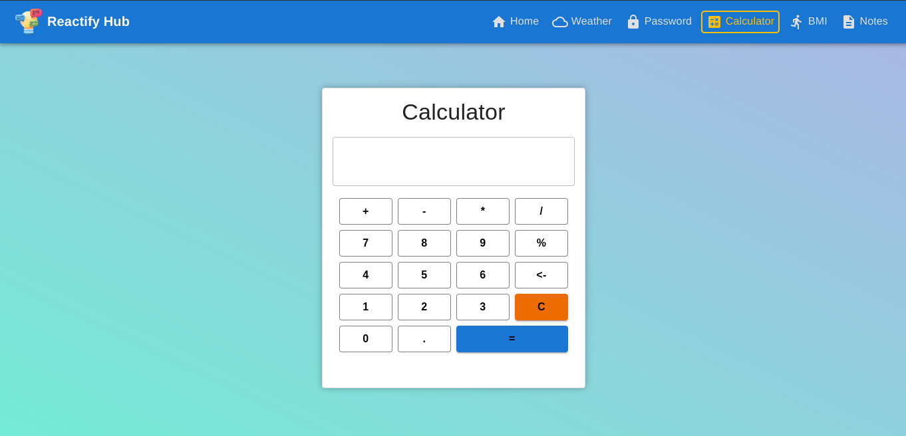

# Reactify Hub

Welcome to Reactify Hub, a collection of interactive experiments built with React! This project serves as a playground for various React applications, showcasing the power and flexibility of this popular JavaScript library.
This repository contains a series of mini-projects, each demonstrating different functionalities and features that can be achieved using React. From password validation to weather forecasting, these experiments highlight the versatility of React in creating dynamic user interfaces.
This project is a great resource for developers looking to learn more about React, experiment with its capabilities, or simply explore some fun and useful applications. Whether you're a beginner or an experienced developer, you'll find something interesting here.

<!-- See Screenshots below scroll to screenshot section -->

## Features

1. **Password Validation**: Test the strength of your passwords with our password validation tool. Ensure your accounts stay secure with robust password practices.

2. **Calculator**: Crunch numbers with ease using our sleek calculator. Whether you're balancing your budget or solving complex equations, our calculator makes math a breeze.

3. **BMI Calculator**: Stay on top of your health goals with our BMI calculator. Track your body mass index and monitor your progress towards a healthier lifestyle.

4. **Weather App**: Plan your day with confidence using our weather app. Stay informed about current conditions and get accurate forecasts to help you prepare for any weather.

5. **Todo Lists**: Stay organized and productive with our todo lists. Manage your tasks, set reminders, and prioritize your goals to stay on track and accomplish more.

Each experiment highlights React's prowess in creating dynamic and interactive UIs, from secure password handling to real-time weather forecasting.

## Get Started

To explore these experiments, simply navigate to each section using the provided links or buttons. Have fun experimenting with React!

## Technologies

- React
- Material-UI

## Steps to Run

1. Clone the repository:

```bash
git clone https://github.com/amankrs21/reactify-hub.git
```

2. Install dependencies:

```bash
npm install
```

3. Run the app:

```bash
npm run dev
```

4. Open [http://localhost:5173](http://localhost:5173) to view it in the browser.

5. Enjoy the experiments!

## Hosting

This project is hosted on Cloudflare. You can access it [here](https://reactify-hub.pages.dev).

## License

This project is licensed under the MIT License. Feel free to use, modify, and distribute it as you wish. For more details, please refer to the [LICENSE](LICENSE) file.

## Author

- [Aman Singh](https://github.com/amankrs21)

## Acknowledgements
- Thanks to the React community for their continuous support and contributions.
- Special thanks to the creators of Material-UI for providing a great UI framework that enhances the user experience of this project.


## Screenshots

Here are some screenshots showcasing the various experiments in Reactify Hub:

1. **Password Validation Tool**  
    

2. **Calculator**  
    

3. **BMI Calculator**  
    

4. **Weather App**  
    

5. **Todo Lists**  
    

These images provide a glimpse into the functionality and design of each experiment. Explore the project to see them in action!
